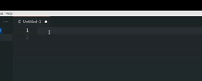

[]()
[]()


# Visual Studio Code snippets for AsciiDoc

VS Code snippets are templates that make it easier to enter repeating code patterns, such as loops or conditional-statements.

This extension provides snippets for the AsciiDoc language that is used at Red Hat for authoring content.

Additionally, it also includes snippets for Modular documentation templates (for concept, procedure, reference, and assembly) and a technology preview snippet (to indicate that a feature is in Technology Preview).

Here is an example of a VS Code snippet for a *NOTE*:

```
"note": {
      "body": "[NOTE]\n====\n$1\n====\n$0",
      "prefix": "note"
    },
```

To test and verify if the snippets are working as expected:

* Ensure [VS Code AsciiDoc](https://marketplace.visualstudio.com/items?itemName=asciidoctor.asciidoctor-vscode) is installed
* Create and/or open a new file which has `.adoc` extension in VS Code
* Type a snippet name; for example, `note`
* Trigger completion (usually by pressing **Ctrl+space** or **Tab**) and accept the `note` snippet by hitting `Enter` key



# How to install

Search for `Snippets for AsciiDoc` extension on the Marketplace.

More information how to search and install available on the [official VS Code documentation](https://code.visualstudio.com/docs/editor/extension-marketplace).

# List of snippets included:

| Name	      		 	     | Prefix        	|
| :---        		 	     |     	---:     	|
| 2-column table     	     | table2        	|
| 3-column table   	 	     | table3        	|
| Copyright symbol   	     | copyright     	|
| Em dash   		 	     | em-dash       	|
| En dash   		 	     | en-dash       	|
| Horizontal ellipsis	     | ellipsis      	|
| Paragraph symbol 	 	     | para          	|
| Plus or minus     		 | plus or minus 	|
| Registered trademark symbol| trademark-r   	|
| Section symbol   			 | section       	|
| Trademark symbol   		 | trademark     	|
| anchor id tag   			 | anchor-id     	|
| bash codeblock   			 | bash-codeblock	|
| bold   					 | bold          	|
| callout   				 | callout       	|
| caution   				 | caution      	|
| command      				 | command      	|
| email   				 	 | email         	|
| filename   				 | filename      	|
| ifdef   				     | ifdef        	|
| ifeval   				 	 | ifeval        	|
| ifndef   				 	 | ifndef        	|
| image   				 	 | image         	|
| important   				 | imp           	|
| include   				 | incl         	|
| italic   				  	 | italic        	|
| link   				 	 | link          	|
| literal   				 | literal       	|
| literal codeblock   		 | literal-codeblock|
| note   				 	 | note        		|
| package   				 | package        	|
| step cli   				 | step-cli        	|
| subscript   				 | sub        		|
| superscript   			 | sup        		|
| tip   				 	 | tip        		|
| warning   				 | warn        		|
| xml codeblock   			 | xml-codeblock    |
| xref   				     | xref        		|
| yaml codeblock   			 | yaml-codeblock   |
| assembly   			 | assembly   |
| concept   			 | concept   |
| procedure   			 | procedure   |
| reference   			 | reference   |
| technology preview   			 | tech-preview   |

If you want to improve the provided snippets, please check how to contribute to this extension [here](Contributing.md#how-to-provide-more-snippets).
