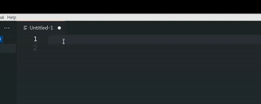

# AsciiDoc snippets for Visual Studio Code

VS Code snippets are templates that make it easier to enter repeating code patterns, such as loops or conditional-statements.

VS Code Snippets are written in JSON. Each snippet is defined under a snippet `name` and has a `scope`, `prefix`, `body`, and `description`. If `scope` is left empty or omitted, the snippet gets applied to all languages. The `prefix` is what is used to trigger the snippet and the body will be expanded and inserted.

The `vscoderh.code-snippets` file includes snippets for the AsciiDoc language that is used at Red Hat for authoring content. 

I have only specified the `name`, `prefix`, and `body` parameters. Since the `name` seemed intuitive to me, I dropped the `description`.

Here is an example of a VS Code snippet for a *NOTE*:

```
"note": {
      "body": "[NOTE]\n====\n$1\n====\n$0",
      "prefix": "note"
    },
```

1. After you install VS Code on your Linux distro, you will find a `Code` directory under `/home/<kerberos_ID>/.config`.
2. Place the snippets file under `/home/<kerberos_ID>/.config/Code/User/snippets`.

To test and verify if the snippets are working as expected, open a new file (without specifying the language) in VS Code and type a snippet name and press **Tab**; for example, "note".



## List of snippets included in the snippets file:
| Name	      		 	     | Prefix        	| 
| :---        		 	     |     	---:     	| 
| 2-column table     	     | table2        	| 
| 3-column table   	 	     | table3        	| 
| Copyright symbol   	     | copyright     	| 
| Em dash   		 	     | em-dash       	| 
| En dash   		 	     | en-dash       	| 
| Horizontal ellipsis	     | ellipsis      	| 
| Paragraph symbol 	 	     | para          	| 
| Plus or minus     		 | plus or minus 	| 
| Registered trademark symbol| trademark-r   	| 
| Section symbol   			 | section       	| 
| Trademark symbol   		 | trademark     	| 
| anchor id tag   			 | anchor-id     	| 
| bash codeblock   			 | bash-codeblock	| 
| bold   					 | bold          	| 
| callout   				 | callout       	| 
| caution   				 | caution      	| 
| command      				 | command      	| 
| email   				 	 | email         	|
| filename   				 | filename      	|
| ifdef   				     | ifdef        	|
| ifeval   				 	 | ifeval        	|
| ifndef   				 	 | ifndef        	|
| image   				 	 | image         	|
| important   				 | imp           	|
| include   				 | incl         	|
| italic   				  	 | italic        	|
| link   				 	 | link          	|
| literal   				 | literal       	|
| literal codeblock   		 | literal-codeblock|
| note   				 	 | note        		|
| package   				 | package        	|
| step cli   				 | step-cli        	|
| subscript   				 | sub        		|
| superscript   			 | sup        		|
| tip   				 	 | tip        		|
| warning   				 | warn        		|
| xml codeblock   			 | xml-codeblock    |
| xref   				     | xref        		|
| yaml codeblock   			 | yaml-codeblock   |

For more information about creating your own VS Code Snippets, see [Create your own snippets](https://code.visualstudio.com/docs/editor/userdefinedsnippets#_create-your-own-snippets).
